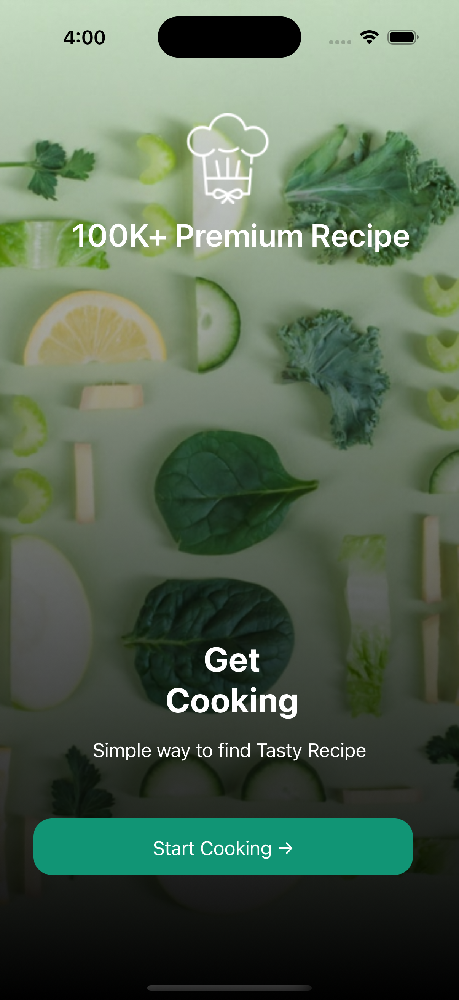
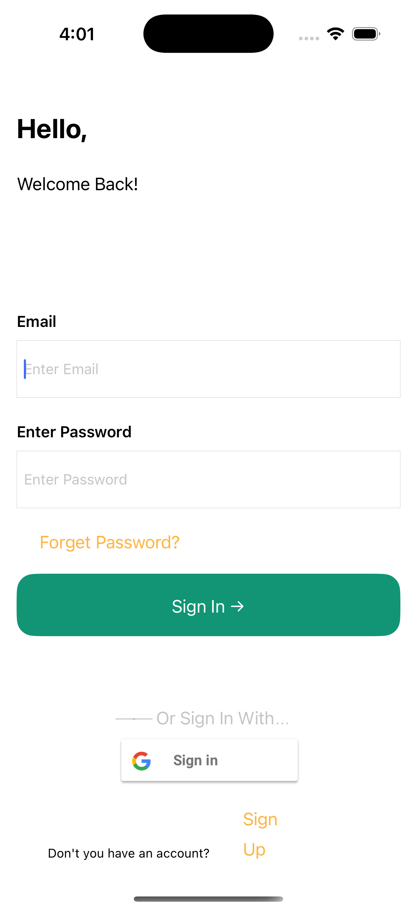
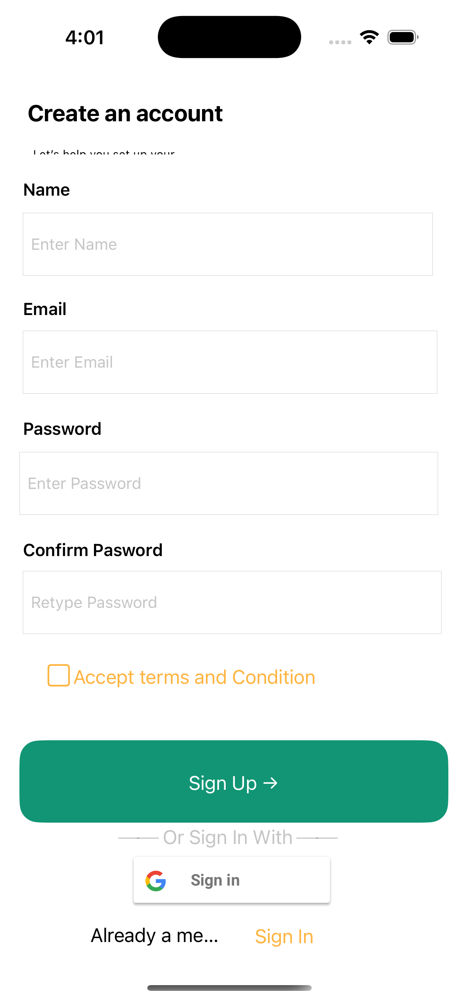
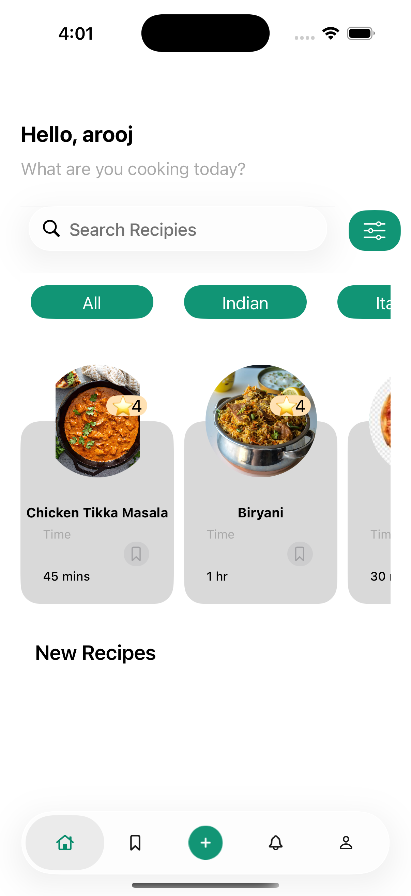
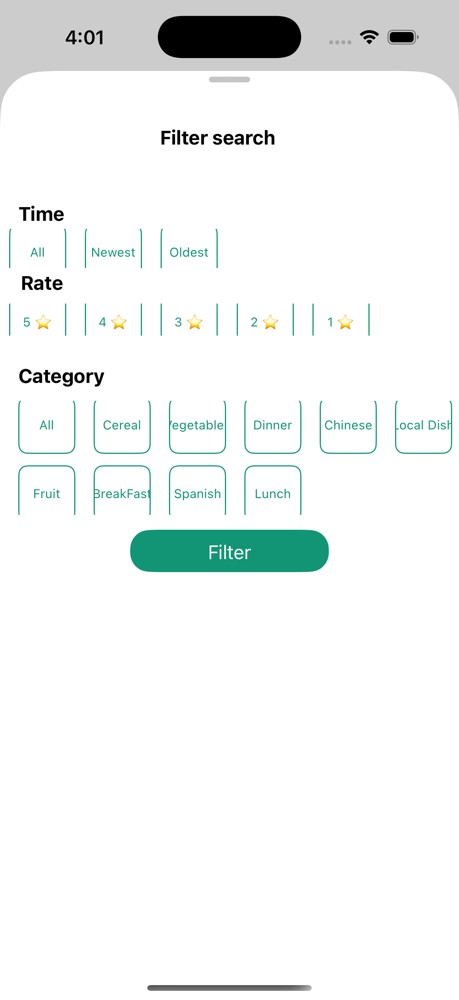
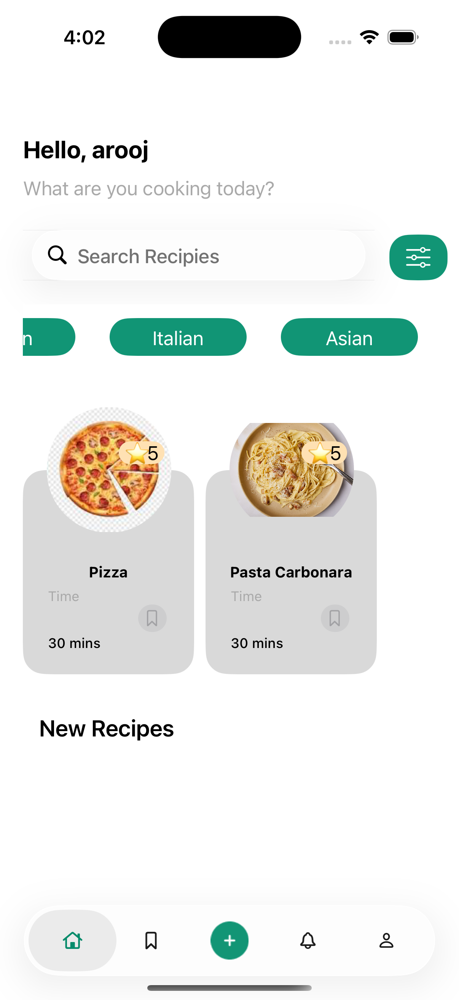
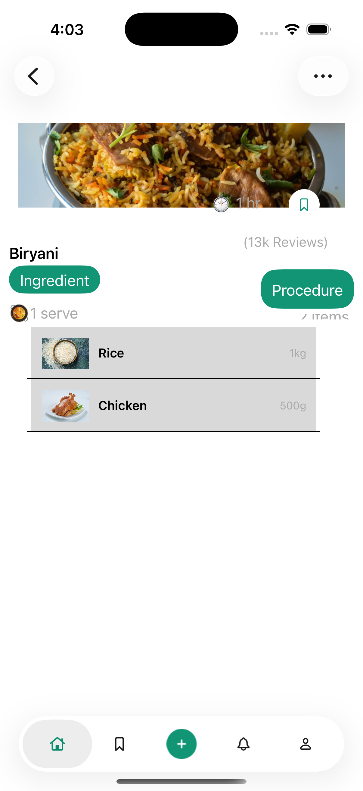
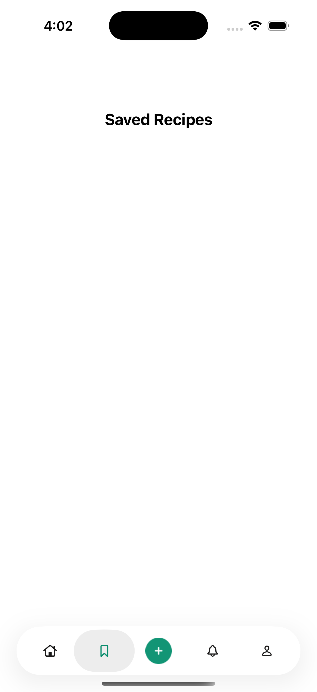

# 🍲 Food Recipe App

An iOS recipe-discovery app built with **Swift** and **UIKit**, architected end-to-end with **MVVM**. Users can sign up, browse and search recipes, filter them by time/rating/category, save favorites for offline access, rate recipes, and get notified — all backed by **Firebase** for auth/cloud data and **Realm** for local persistence.

> This project was built as a showcase of clean MVVM architecture in a real, feature-complete UIKit app — protocol-driven view/view-model contracts, a singleton service layer, and a clear separation between remote (Firestore) and local (Realm) data sources.

---

## ✨ Features

- **Authentication** — Email/password sign up & login, Google Sign-In, and a "forgot password" flow, all backed by Firebase Auth.
- **Splash / session check** — Automatically routes returning, authenticated users straight to the home screen.
- **Browse recipes** — A scrollable home feed of recipes grouped by category, loaded from Firestore.
- **Recipe details** — Ingredients list, step-by-step procedure, and cook time for every recipe.
- **Search** — Find recipes by name, category, or ingredient.
- **Filter** — Narrow results by preparation time, rating, and category via a dedicated filter sheet (`FilterManager`).
- **Save for later** — Bookmark favorite recipes to a local Realm database for fast, offline-friendly access.
- **Rate & review** — Rate recipes from the detail screen.
- **Notifications** — A notification center backed by Firestore, with read/unread state.
- **Profile & side menu** — User profile screen and app-wide navigation via a slide-out side menu (`SideMenu`).
- **Async image loading** — Recipe imagery is loaded and cached asynchronously with `SDWebImage`.

---

## 🏗️ Architecture — MVVM

The app strictly follows **Model–View–ViewModel**, with explicit `protocol` contracts binding each layer together instead of ad-hoc callbacks:

```
Food-Recipie-App/
├── Controller/        # UIViewControllers — the "View" layer, drives UIKit lifecycle & wiring
├── View/               # Reusable UICollectionViewCells / UITableViewCells (+ .xib)
├── View Model/         # Business/presentation logic per screen (HomeViewModel, LoginViewModel, ...)
├── Model/              # Screen-level & domain models (FilterModel, FilterState, User, Notification, ...)
├── Data Model/         # Firestore-mapped domain entities (Recipes, Ingredient, Procedure)
├── Protocol/           # ViewModelProtocol.swift & ViewProtocol.swift — delegate contracts binding View <-> ViewModel
├── Services/           # Singleton service layer (DatabaseManager, RealmManager, FilterManager)
├── Extension/          # Per-screen UIViewController extensions (UITableView/UICollectionView datasource & delegate code)
└── Assets.xcassets/    # Images, colors, app icon
```

**How the layers talk to each other:**

- **View (Controller)** owns a `ViewModel` and implements a delegate protocol (e.g. `LoginViewModelDelegate`, `AuthenticationDelegate`, `SplashViewDelegate`) so the ViewModel can push results/errors back up without knowing about `UIKit`.
- **ViewModel** exposes intent methods (e.g. `isUserAuthenticated()`) and talks to the **Services** layer — never directly to Firebase or Realm APIs from the View.
- **Services** are singletons (`DatabaseManager.shared`, `RealmManager.shared`, `FilterManager.shared`) that isolate all Firestore/Auth/Realm access behind a small API surface, so the rest of the app is agnostic to the underlying persistence/backend.
- **Data Model** types (`Recipes`, `Ingredient`, `Procedure`) are Realm `Object` subclasses that are also constructable from raw Firestore documents, bridging the remote and local data worlds.

This separation means view controllers stay thin (UI + wiring only), business logic is unit-testable in isolation inside the ViewModels, and swapping a data source (e.g. Firestore → REST API) would only touch the `Services` layer.

---

## 📸 Screenshots

| Splash | Login | Signup | Home |
|---|---|---|---|
|  |  |  |  |

| Search using filters | Reigon Filter | Recipe Detail | Saved Recipes |
|---|---|---|---|
|  |  |  |  |

---

## 🛠️ Tech Stack

| Layer | Technology |
|---|---|
| Language | Swift 5 |
| UI Framework | UIKit (Storyboards + XIBs, programmatic layout in places) |
| Architecture | MVVM with protocol-based delegation |
| Remote backend | [Firebase](https://firebase.google.com/) — Firestore (recipes, users, notifications) & Firebase Auth |
| Social login | Google Sign-In (`GoogleSignIn`) |
| Local persistence | [Realm](https://realm.io/) (`RealmSwift`) — offline storage for saved recipes |
| Image loading | [SDWebImage](https://github.com/SDWebImage/SDWebImage) — async image fetch + caching |
| Navigation | [SideMenu](https://github.com/jonkykong/SideMenu) — slide-out navigation drawer |
| Dependency management | CocoaPods |
| Minimum iOS version | iOS 15.5 |

### Dependencies (`Podfile`)

```ruby
pod 'FirebaseAuth'
pod 'FirebaseFirestore'
pod 'GoogleSignIn'
pod 'RealmSwift', '10.39.0'
pod 'SideMenu'
pod 'SDWebImage'
```

---

## 📂 Key Screens (Controllers)

| Controller | Responsibility |
|---|---|
| `SplashViewController` | Checks auth state on launch and routes accordingly |
| `LoginViewController` / `SignupViewController` | Email/password + Google authentication |
| `ForgetPasswordViewController` | Password reset via Firebase Auth |
| `HomeViewController` | Main recipe feed, categories |
| `SearchRecipeViewController` | Search by name/category/ingredient |
| `FilterViewController` | Filter recipes by time, rating, category |
| `RecipeDetailViewController` | Full recipe view — ingredients, steps, rating |
| `SavedRecipeViewController` | Locally saved (Realm) recipes |
| `NotificationViewController` | Notification center |
| `ProfileViewController` | User profile |

---

## 🚀 Getting Started

### Prerequisites

- macOS with **Xcode 14+**
- [CocoaPods](https://cocoapods.org/) installed (`sudo gem install cocoapods`)
- A [Firebase](https://console.firebase.google.com/) project with **Authentication** (Email/Password + Google) and **Cloud Firestore** enabled

### Installation

1. **Clone the repository**
   ```bash
   git clone <repository-url>
   cd Recipe-Food-App-main
   ```

2. **Install CocoaPods dependencies**
   ```bash
   pod install
   ```

3. **Add your Firebase config**
   - Create/download your own `GoogleService-Info.plist` from the Firebase console and replace `Food-Recipie-App/GoogleService-Info.plist`.
   - Make sure Google Sign-In's reversed client ID is registered as a URL scheme in `Info.plist` (already wired up for the template config).

4. **Open the workspace (not the `.xcodeproj`)**
   ```bash
   open Food-Recipie-App.xcworkspace
   ```

5. **Build & run** on a simulator or device from Xcode (⌘R).

---

## 📱 Usage

1. Sign up or log in (email/password or Google).
2. Browse recipes on the home feed, grouped by category.
3. Use **Search** or **Filter** (time / rating / category) to narrow results.
4. Tap a recipe to view ingredients, procedure, and cook time.
5. Tap **Save** to bookmark a recipe locally (available offline under Saved Recipes).
6. Rate recipes from the detail screen.
7. Check **Notifications** for updates, and manage your account from **Profile**.

---

## 🧪 Testing

A unit test target (`Food-Recipie-AppTests`) is included. Run tests via Xcode's Test navigator or:

```bash
xcodebuild test -workspace Food-Recipie-App.xcworkspace -scheme Food-Recipie-App -destination 'platform=iOS Simulator,name=iPhone 15'
```

---

## 🤝 Contributing

Contributions, issues, and feature requests are welcome. Feel free to fork the repo, create a feature branch, and open a pull request.

